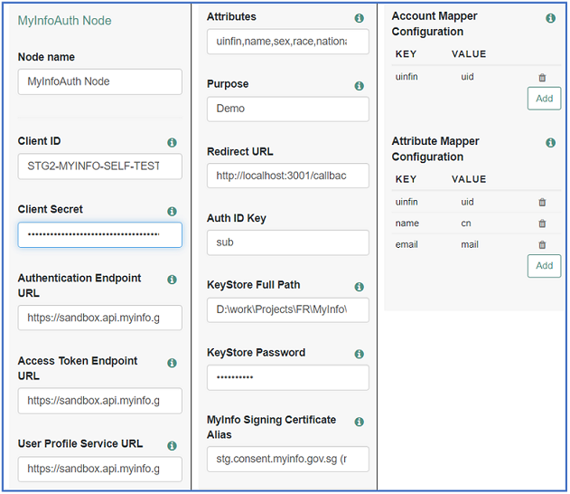
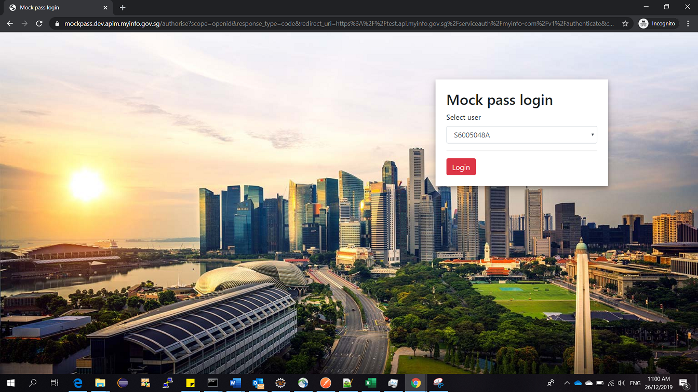
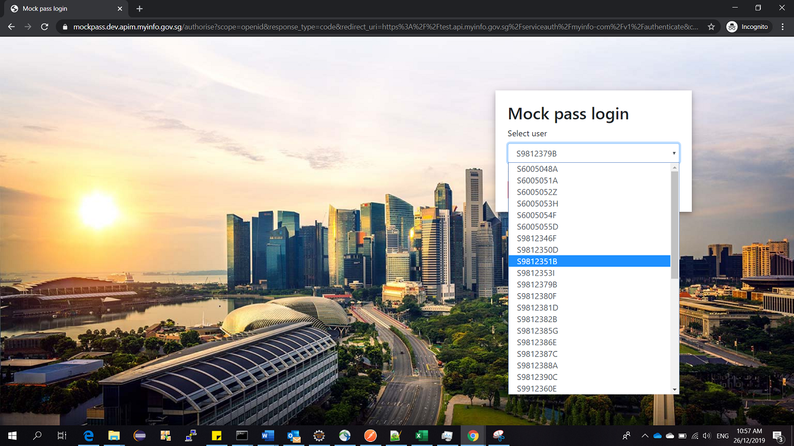
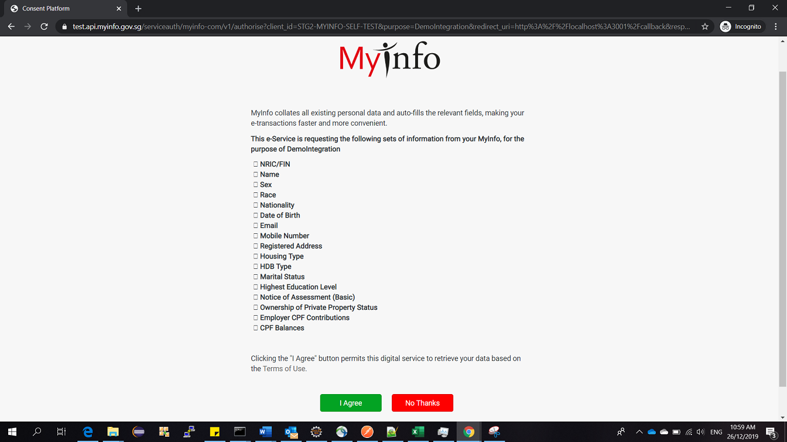
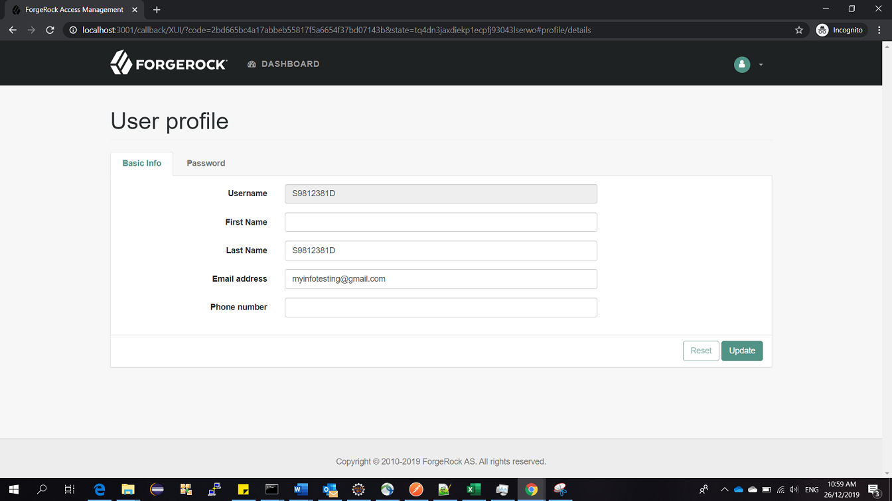

<!--
 * The contents of this file are subject to the terms of the Common Development and
 * Distribution License (the License). You may not use this file except in compliance with the
 * License.
 *
 * You can obtain a copy of the License at legal/CDDLv1.0.txt. See the License for the
 * specific language governing permission and limitations under the License.
 *
 * When distributing Covered Software, include this CDDL Header Notice in each file and include
 * the License file at legal/CDDLv1.0.txt. If applicable, add the following below the CDDL
 * Header, with the fields enclosed by brackets [] replaced by your own identifying
 * information: "Portions copyright [year] [name of copyright owner]".
 *
 * Copyright 2019 ForgeRock AS.
-->
# MyInfoAuthNode

MyInfoAuthNode provides provides OAuth based integration of MyInfo APIs and dynamic provision of user profile.

**Configuration**

-	Required Attributes to configure node:

-   Sample Authentication Tree with MyInfo Node

**Sample Test Case Flow**

1.	Access the below url for invoking the authentication tree:

   http://localhost:3001/callback/XUI/?realm=/&service=MyInfoAuth

2.	User will be redirect to mock pass for authentication as per the below screenshot.

   

3.	Select the user account to login as per the below screenshot.

   

4.	Accept the user consent to share the profile information as below screenshot.

   

5.	Once the consent is accepted, MyInfo node checks for the user account exists in the system, creates an user account and lands on the profile page as below screenshot.

   
